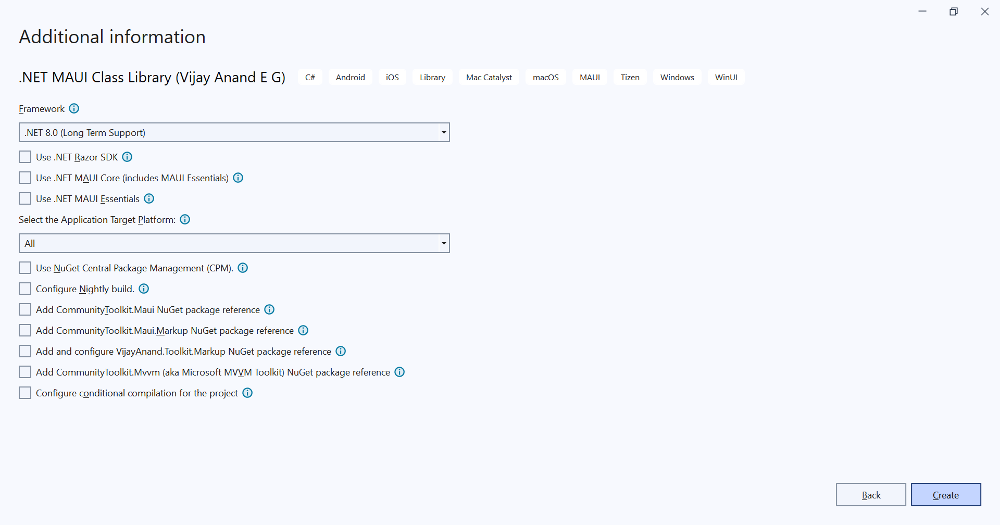
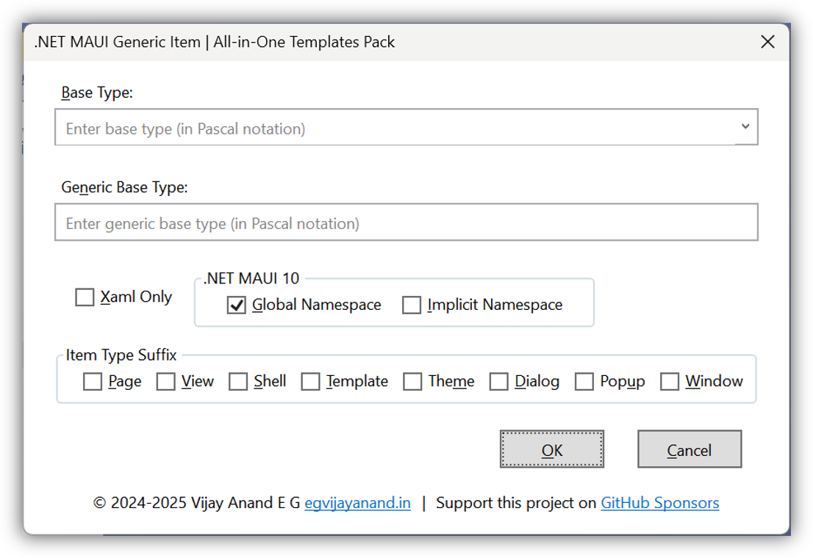

## .NET MAUI Project and Item Templates

This repository is to host the .NET MAUI Project Templates, Item Templates and Code Snippets.

Join me on [**Developer Thoughts**](https://egvijayanand.in/?utm_source=github "Developer Thoughts"), an exclusive blog for .NET MAUI and Blazor, for [articles](https://egvijayanand.in/category/net-maui/templates-net-maui/?utm_source=github) on working with these templates and much more.

We all know that .NET MAUI is an evolution of Xamarin.Forms.

Release Details:

|Channel|.NET MAUI Version|IDE Version|Release Date|Remarks|
|:---:|:---:|:---:|:---:|:---:|
|Stable|.NET 6 SR11 (6.0.553)|VS2022 17.4.x - 17.8.x|Tue, Apr 25, 2023|[Out of Support](https://dotnet.microsoft.com/en-us/platform/support/policy/maui ".NET MAUI Support Policy")|
|Stable|.NET 7 SR10 (7.0.101)|VS2022 17.4.x - 17.9.x|Tue, Nov 7, 2023|[Out of Support](https://dotnet.microsoft.com/en-us/platform/support/policy/maui ".NET MAUI Support Policy")|
|Stable|[.NET 8 SR5](https://github.com/dotnet/maui/releases/tag/8.0.40 "Changelog") (8.0.40) <br /> _Requires Android SDK Platform 34_|VS2022 17.9.x|Tue, May 14, 2024|Active|
|Preview|[.NET 9 Preview 3](https://github.com/dotnet/maui/releases/tag/9.0.0-preview.3.10457 "Changelog") (9.0.0-preview.3.10457) <br /> _Requires Android SDK Platform 34_|VS2022 17.10 Preview 7.0|Thu, Apr 11, 2024|Preview|

Use the below commands to verify the version installed:

```shell
dotnet --version
```
```shell
dotnet workload list
```

And to install a workload, run the following command:

On Windows, this is to be executed on an `elevated prompt`:

```shell
dotnet workload install maui
```

On macOS:

```shell
sudo dotnet workload install maui
```

On Linux (Only `Android` workload is supported for now):

```shell
sudo dotnet workload install maui-android
```

If already installed, can be updated to the latest version with the below command:

```shell
dotnet workload update
```

Templates have been updated to support .NET 6/7/8 and is available to install from.

|Channel|NuGet|VS Marketplace|
|:---:|:---:|:---:|
|Stable|[](https://www.nuget.org/packages/VijayAnand.MauiTemplates/)|[](https://marketplace.visualstudio.com/items?itemName=egvijayanand.maui-templates)|
<!--
|Preview|[](https://www.nuget.org/packages/VijayAnand.MauiTemplates/absoluteLatest)| - |
-->

### For VS2022 users:

To provide an integrated experience, a VS extension has been developed to host these templates.

Extension is made available in the [Visual Studio Marketplace](https://marketplace.visualstudio.com/items?itemName=egvijayanand.maui-templates ".NET MAUI Templates Pack") and even more easier, can be installed from within Visual Studio itself (Extensions -> Manage Extensions / Alt + X + M).


This has Project Templates for:

* .NET MAUI App - An All-in-One .NET MAUI App Project Template - For more details, check out this [article](https://egvijayanand.in/all-in-one-dotnet-maui-app-project-template/ "All-in-One .NET MAUI App Project Template")
* .NET MAUI Class Library
* Shared Class Library (Xamarin.Forms and .NET MAUI)


And has Item Templates for:

* [Generic Item](#generic-item-template)
* [Generic Item (C#)](#generic-item-template)
* Content Page
* Content Page (C#)
* Content Page (Razor)
* Content Page with BlazorWebView
* Content Page with BlazorWebView (C#)
* Content Page with ViewModel
* Content Page (C#) with ViewModel
  - For both the `Page with ViewModel` templates, ensure only the real page name alone is provided as input like `Settings` as the `Page` and `ViewModel` will be suffixed to it like `SettingsPage` and `SettingsViewModel`. And Page will be generated in the `Views` folder and ViewModel will be generated in the `ViewModels` folder.
  - The ViewModels are generated with the base class titled `BaseViewModel` (implementation left to the user).
  - Recommended to add [CommunityToolkit.Mvvm](https://www.nuget.org/packages/CommunityToolkit.Mvvm), an officially supported NuGet package, to make it easy to work with MVVM design pattern.
  - This MVVM - Made Easy [Part 1](https://egvijayanand.in/2022/04/22/mvvm-made-easy/) and [Part 2](https://egvijayanand.in/2022/05/09/mvvm-made-easy-with-microsoft-mvvm-toolkit-part-2/) articles can help you to get started with this brand-new NuGet package.
* Content View
* Content View (C#)
* Content View (Razor)
* Resource Dictionary
* Resource Dictionary (XAML only)
* Shell Page
* Shell Page (C#)
* Custom View and Handler (Regular)
  - Handler definitions generated in the Platforms folder
* Custom View and Handler (Cond.)
  - Handler definitions generated in the same folder in conditional compilation format
* Custom View and Renderer (Regular)
  - Renderer definitions generated in the Platforms folder
* Custom View and Renderer (Cond.)
  - Renderer definitions generated in the same folder in conditional compilation format
* Comet Page (C#)
* Partial Class (C#)
  - Made available in the section titled `Code`
\
&nbsp;
* For Cond. type template to work properly, ensure Conditional Compilation is enabled (mentioned in detail [**here**](https://github.com/egvijayanand/dotnet-maui-templates#conditional-compilation "Conditional Compilation"))

Now VS2022 extension is loaded with 25+ C# and XAML Code Snippets.

XAML Snippets for new Layouts, Gestures, Color, Style.

C# Snippets for Properties such as Attached, Bindable, ViewModel and Comet (MVU design pattern).

Types such as `record` and `record struct`.

Snippets for Method definition, Event Handler definition (async version also).


### .NET CLI Template

For making use of these templates cross-platform, have provided it as .NET CLI template package distributed via NuGet.

<!-- [](https://www.nuget.org/packages/VijayAnand.MauiTemplates/) -->

Install the template package from NuGet with the below command.

Stable:

```shell
dotnet new install VijayAnand.MauiTemplates
```

<!--
Preview:

```shell
dotnet new install VijayAnand.MauiTemplates::4.4.0-preview.5
```
-->

If you've already installed this package, then this can be updated to the latest version with the below command.

```shell
dotnet new update --check-only
```
```shell
dotnet new update
```

This comes with with the following templates:

Name | Template Name | Type
:---: | :---: | :---:
|[All-in-One .NET MAUI App](#all-in-one-net-maui-app-project-template)|mauiapp|Project|
|[.NET MAUI Class Library](#net-maui-class-library-template)|mauiclasslib|Project|
|[Shared Class Library](#shared-class-library-template)|sharedclasslib|Project|
|[.NET MAUI Item (XAML)](#generic-item-template)|maui-item|Item|
|[.NET MAUI Item (C#)](#generic-item-template)|maui-item-cs|Item|
|ContentPage (XAML)|maui-page|Item|
|ContentPage (C#)|maui-page-cs|Item|
|ContentPage (Razor)|maui-page-razor|Item|
|ContentView (XAML)|maui-view|Item|
|ContentView (C#)|maui-view-cs|Item|
|ContentView (Razor)|maui-view-razor|Item|
|ResourceDictionary|maui-resdict|Item|
|ShellPage (XAML)|maui-shell|Item|
|ShellPage (C#)|maui-shell-cs|Item|
|ShellPage (Razor)|maui-shell-razor|Item|
|[ContentPage with ViewModel](#page-with-viewmodel)|maui-mvvm|Item|
|[ContentPage with ViewModel (C#)](#page-with-viewmodel)|maui-mvvm-cs|Item|
|ContentPage with BlazorWebView (XAML)|maui-bwv|Item|
|ContentPage with BlazorWebView (C#)|maui-bwv-cs|Item|
|[Partial Class (C#)](#partial-class-item-template)|class-cs|Item|


#### Parameters:

Starting with [v2.0.0](https://www.nuget.org/packages/VijayAnand.MauiTemplates/2.0.0) of the template package, to effectively support .NET MAUI on both `.NET 6` and `.NET 7`, CLI project template defines a new parameter named `framework`:

And from [v3.0.0](https://www.nuget.org/packages/VijayAnand.MauiTemplates/3.0.0) of the template package, CLI project template `framework` parameter adds `.NET 8` as another option.

And from [v4.0.0](https://www.nuget.org/packages/VijayAnand.MauiTemplates/4.0.0) of the template package, CLI project template defines a new parameter named `language`:

And from [v4.4.0](https://www.nuget.org/packages/VijayAnand.MauiTemplates/4.4.0) of the template package, CLI project template defines a new parameter named `central-pkg-mgmt`:

And from [v4.5.0](https://www.nuget.org/packages/VijayAnand.MauiTemplates/4.5.0) of the template package, CLI project template defines a new parameter named `include-shared-toolkit`:

And from [v4.6.0](https://www.nuget.org/packages/VijayAnand.MauiTemplates/4.6.0) of the template package, CLI project template defines a new parameter named `nightly`:

And from [v5.0.0](https://www.nuget.org/packages/VijayAnand.MauiTemplates/5.0.0) of the template package, CLI project template `framework` parameter adds `.NET 9` as another option.

* Nightly build: (Short notation: `-ni`):

  Option to reference Nightly build MAUI packages (from the [CI feed](https://dev.azure.com/xamarin/public/_artifacts/feed/maui-nightly "CI Feed")) in all the supported templates.

  `-ni` | `--nightly` This is a Boolean parameter - Default value is `false`. _Can also be used with the CPM option too_.

  Note: For this work, add the following URL as a NuGet package source (make use of the command) and more details [here](https://github.com/dotnet/maui/wiki/Nightly-Builds "Nightly Builds"):

  *.NET MAUI getting released as NuGet packages is supported only from .NET 8. So, this nightly build option won't work with .NET 7 and earlier.*


  ```shell
  dotnet nuget add source -n maui-nightly https://aka.ms/maui-nightly/index.json
  ```

  Examples:

  ```shell
  dotnet new mauiapp -o MyApp -ni
  ```

  ```shell
  dotnet new mauiclasslib -o MauiLib -ni
  ```

  ```shell
  dotnet new sharedclasslib -o SharedLib -ni
  ```

* Central Package Management: (Short notation: `-cpm`):

  This is a Boolean parameter and its default value is `false`. _For now, this option is supported only on CLI._

  Examples:

  ```shell
  dotnet new mauiapp -o MyApp -cpm
  ```

  ```shell
  dotnet new mauiclasslib -o MauiLib -cpm
  ```

  ```shell
  dotnet new sharedclasslib -o SharedLib -cpm
  ```

* Language: (Short notation: `-lang`):

  This can take `C#` / `F#` as its options (with `C#` being the default value, if not specified).

  Examples:

  ```shell
  dotnet new mauiapp -lang F#
  ```

  For creating a .NET MAUI App on .NET 7:

  ```shell
  dotnet new mauiapp -lang F# -f net7.0
  ```

* Framework: (Short notation: `-f`)

  This can take `net6.0` / `net7.0` / `net8.0` / `net9.0` as its options (with `net8.0` being the default value, if not specified).

  Examples:

  ```shell
  dotnet new mauiapp -f net6.0
  ```

  ```shell
  dotnet new mauiapp -f net7.0
  ```

  For creating a .NET MAUI App on .NET 8:

  Below command can be simplified to `dotnet new mauiapp` as default value of `framework` parameter is `net8.0`

  ```shell
  dotnet new mauiapp -f net8.0
  ```

  For creating a .NET MAUI App on .NET 9:

  _Explicit value for the `framework` parameter is required._

  ```shell
  dotnet new mauiapp -f net9.0
  ```

In .NET CLI, all of these _Items Template_ require a mandatory parameter:

* Name: (Short notation: `-n`)

    The name of the Item/Page/View to create. _For Pages/Views, don't need to suffix it with the name like .xaml_, it will get added.

    _If the name parameter is not specified, by default, the **.NET CLI template engine will take the current folder name as the filename** (current behaviour of the templating engine)._

<!--
* Namespace: (Short notation: `-na`)

    The namespace for the generated files.

    *While working with .NET 7 SDK or later, the namespace parameter in short notation needs to be passed as `-p:na` (i.e., it needs to be prefixed with `-p:`).*
-->

* Now with more options while creating the app or class library project, ability to include NuGet packages on the fly for `CommunityToolkit.Maui`, `CommunityToolkit.Maui.Markup`, `CommunityToolkit.Mvvm` or all.

*Note: Parameter values are case-insensitive.*

Both .NET MAUI *App* and *Class Library* templates take the below optional Boolean parameters to include the officially supported `CommunityToolkit` NuGet packages:

*Specifying the parameter name, either in short or full notation, implies that it is defined.*

* `-it` | `--include-toolkit` - Default is `false`
* `-im` | `--include-markup` - Default is `false`
* `-imt` | `--include-mvvm-toolkit` - Default is `false`

Other Parameters:

* `-ist` | `--include-shared-toolkit` - Default is `false`
* `-cc` | `--conditional-compilation` - Default is `false`

#### Conditional Compilation

And now conditional compilation can be configured so that platform source files can be defined anywhere in the project provided they follow a naming convention as mentioned below. This will allow maintaining related source files in the same place, especially MAUI Handlers.

* \*.Standard.cs - Files targeting the BCL
* \*.Android.cs - Files specific to Android
* \*.iOS.cs - Files shared with both iOS and MacCatalyst
* \*.MacCatalyst.cs - Files specific to MacCatalyst
* \*.Tizen.cs - Files specific to Tizen
* \*.Windows.cs - Files specific to Windows

For existing projects, add the below block of code in the project file (.csproj). _This will modify the behavior of build process so due care must be taken if doing so._

```xml
<ItemGroup Condition="'$(TargetFramework)' != 'net8.0'">
    <Compile Remove="**\*.Standard.cs" />
    <None Include="**\*.Standard.cs" Exclude="$(DefaultItemExcludes);$(DefaultExcludesInProjectFolder)" />
</ItemGroup>

<ItemGroup Condition="$([MSBuild]::GetTargetPlatformIdentifier('$(TargetFramework)')) != 'ios' AND $([MSBuild]::GetTargetPlatformIdentifier('$(TargetFramework)')) != 'maccatalyst'">
    <Compile Remove="**\*.iOS.cs" />
    <None Include="**\*.iOS.cs" Exclude="$(DefaultItemExcludes);$(DefaultExcludesInProjectFolder)" />
    <Compile Remove="**\iOS\**\*.cs" />
    <None Include="**\iOS\**\*.cs" Exclude="$(DefaultItemExcludes);$(DefaultExcludesInProjectFolder)" />
</ItemGroup>

<ItemGroup Condition="$([MSBuild]::GetTargetPlatformIdentifier('$(TargetFramework)')) != 'android'">
    <Compile Remove="**\*.Android.cs" />
    <None Include="**\*.Android.cs" Exclude="$(DefaultItemExcludes);$(DefaultExcludesInProjectFolder)" />
    <Compile Remove="**\Android\**\*.cs" />
    <None Include="**\Android\**\*.cs" Exclude="$(DefaultItemExcludes);$(DefaultExcludesInProjectFolder)" />
</ItemGroup>

<ItemGroup Condition="$([MSBuild]::GetTargetPlatformIdentifier('$(TargetFramework)')) != 'maccatalyst'">
    <Compile Remove="**\*.MacCatalyst.cs" />
    <None Include="**\*.MacCatalyst.cs" Exclude="$(DefaultItemExcludes);$(DefaultExcludesInProjectFolder)" />
    <Compile Remove="**\MacCatalyst\**\*.cs" />
    <None Include="**\MacCatalyst\**\*.cs" Exclude="$(DefaultItemExcludes);$(DefaultExcludesInProjectFolder)" />
</ItemGroup>

<ItemGroup Condition="$([MSBuild]::GetTargetPlatformIdentifier('$(TargetFramework)')) != 'tizen'">
    <Compile Remove="**\*.Tizen.cs" />
    <None Include="**\*.Tizen.cs" Exclude="$(DefaultItemExcludes);$(DefaultExcludesInProjectFolder)" />
    <Compile Remove="**\Tizen\**\*.cs" />
    <None Include="**\Tizen\**\*.cs" Exclude="$(DefaultItemExcludes);$(DefaultExcludesInProjectFolder)" />
</ItemGroup>

<ItemGroup Condition="$([MSBuild]::GetTargetPlatformIdentifier('$(TargetFramework)')) != 'windows'">
    <Compile Remove="**\*.Windows.cs" />
    <None Include="**\*.Windows.cs" Exclude="$(DefaultItemExcludes);$(DefaultExcludesInProjectFolder)" />
    <Compile Remove="**\Windows\**\*.cs" />
    <None Include="**\Windows\**\*.cs" Exclude="$(DefaultItemExcludes);$(DefaultExcludesInProjectFolder)" />
</ItemGroup>
```

#### All-in-One .NET MAUI **App** Project Template:

This takes two additional parameters to define the application design pattern and target platform respectively. Not all options are supported in the F# template. For now, only Plain and Hybrid option is available.

* `-dp` | `--design-pattern`

Can take any one of the following values, with default value set to `Plain`:

|Parameter Value|Description|
|:---:|:---|
|Plain|App configured to work with a single, initial screen.|
|Hierarchical|App configured to work in a Hierarchical pattern using NavigationPage.|
|Tab|App configured to work in a Tabbed fashion using TabbedPage.|
|Shell|App configured to work with Routes using Shell page.|
|Hybrid|App configured to work in a Hybrid fashion using BlazorWebView.|
|Markup|App configured to work with C# Markup syntax.|
|Razor|App configured to work with Razor syntax.|
|Comet|App configured to work with MVU pattern using Comet.|
|Reactor|App configured to work with MVU pattern using Reactor.|

* `-tp` | `--target-platform`

Can take a combination of the following values, with default value set to `All`:

|Parameter Value|Description|
|:---:|:---|
|All|Targets all possible .NET MAUI supported platforms.|
|Base|Base framework (.NET 6/7/8) based on the framework opted.|
|Android|Targets Android platform.|
|iOS|Targets iOS platform.|
|macOS|Targets macOS platform via Mac Catalyst.|
|Windows|Targets Windows platform.|
|Tizen|Targets Tizen platform.|
|Mobile|Targets Android and iOS platforms.|
|Desktop|Targets Windows and macOS platforms.|
|Apple|Targets iOS and macOS platforms.|


Additional parameters supported:

MVVM is a delightful and development-friendly design pattern to work with. To support this, a new parameter has been introduced:

* `-mvvm` | `--use-mvvm` - Default is `false`
* `-icb` | `--include-compiled-bindings` - Default is `false`

*Note: Opting for this MVVM option will not have any impact on the App created with Web-based Razor syntax or MVU based Comet/Reactor.*

While creating a Blazor Hybrid App, an option to abstract the Razor components as a separate Razor class library.

* `-rcl` | `--razor-class-library` - Default is `false`

The target for the Windows platform can be either `Package` (MSIX) or `Unpackaged`. By default, it is set as `Package`, this can be overridden while creating the project by including the below parameter:

* `-wu` | `--windows-unpackaged` - Default is `false`

While targeting `.NET 7` or later, an option to add and configure `CommunityToolkit.Maui.MediaElement`, `Microsoft.Maui.Controls.Foldable`, `Microsoft.Maui.Controls.Maps`, or all NuGet packages.

* `-ime` | `--include-media-element` - Default is `false`
* `-if` | `--include-foldable` - Default is `false`
* `-inm` | `--include-maps` - Default is `false`

*With Windows as a target platform, opting for the Maps feature will also include `CommunityToolkit.Maui.Maps` NuGet package.*

*Note: If the project target `.NET 6`, selecting the MediaElement/Foldable/Maps option will NOT have any impact.*

Examples (passing one or more values):

```shell
dotnet new mauiapp --design-pattern Hybrid --target-platform Mobile
```

  ```shell
dotnet new mauiapp -dp Shell -tp Android iOS Windows
```

#### .NET MAUI Class Library Template:

Similar to All-in-One .NET MAUI App, the Class Library project template also takes `target-platform` as a parameter that takes a combination from the same set of values (with `All` being the default value).

* Can be created targeting .NET Razor SDK
  - Parameter name: `--use-razor-sdk` | `-urs`
* Can be created targeting .NET MAUI Core
  - Parameter name: `--use-maui-core` | `-umc`
* Can be created targeting .NET MAUI Essentials
  - Parameter name: `--use-maui-essentials` | `-ume`



#### Shared Class Library Template:

The Target Framework of Xamarin.Forms library can be defined with the the below parameter.

* `-xf` | `--xamarin-forms` 

Supported values are:

* `netstandard2.0` (Default, if not specified)
* `netstandard2.1`

*Define the Target Framework of .NET MAUI library with the `-f` | `--framework` parameter.*

This takes the below optional Boolean parameters to include the officially supported NuGet packages:

*Specifying the parameter name, either in short or full notation, implies that it is defined.*

Single parameter to include all the supported NuGet packages:

* `-asp` | `--all-supported-packages` - Default is `false`

Specific to `Xamarin.Forms`:

* `-ife` | `--include-forms-essentials` - Default is `false`
* `-ift` | `--include-forms-toolkit` - Default is `false`
* `-ifm` | `--include-forms-markup` - Default is `false`

Specific to `.NET MAUI`:

* `-imt` | `--include-maui-toolkit` - Default is `false`
* `-imm` | `--include-maui-markup` - Default is `false`

Common to both:

* `-inmt` | `--include-mvvm-toolkit` - Default is `false`
* `-ist` | `--include-shared-toolkit` - Default is `false`

For more details: run this command in the terminal (use `-h` to save some keystrokes):

```shell
dotnet new mauiapp --help
```
```shell
dotnet new mauiclasslib --help
```
```shell
dotnet new sharedclasslib --help
```

#### Partial Class Item Template:

This item template (short name: `class-cs`) allows to create a C# class from CLI with support for multiple options.

|Parameter Name|Type|Default Value|Remarks|
|:--:|:---:|:---:|:---|
access-modifier|choice|public|Specifies the accessibility of the class type.|
base|text|object|Specifies the base type for the class.|
abstract|bool|false|Option to create the type as abstract.|
partial|bool|true|Option to create the type as partial.|
sealed|bool|false|Option to create the type as sealed.|
static|bool|false|Option to create the type as static.|

Access Modifier parameter (`--access-modifier` | `-am`):

Supported values are:

* public (default value, if not provided)
* internal
* protected
* private

File-scoped Namespace parameter (`-fsn` | `--file-scoped-namespace`), the default value is `false`.

#### Usage:

After installation, use the below command(s) to create new artifacts using the template (both provide the same output):

With parameter names abbreviated:


.NET MAUI App:
```shell
dotnet new mauiapp -n MyApp -dp Shell
```
```shell
dotnet new mauiapp -n MyApp -dp Hybrid
```
```shell
dotnet new mauiapp -n MyApp -dp Markup
```
```shell
dotnet new mauiapp -n MyApp -dp Razor
```
```shell
dotnet new mauiapp -n MyApp -dp Comet
```
```shell
dotnet new mauiapp -n MyApp -dp Reactor
```
Option to use MVVM:
```shell
dotnet new mauiapp -n MyApp -mvvm
```
```shell
dotnet new mauiapp -n MyApp -dp Markup -mvvm
```
Option to use MVVM (Compiled Bindings):
```shell
dotnet new mauiapp -n MyApp -mvvm -icb
```
Option to create Razor class library while creating Blazor Hybrid App:
```shell
dotnet new mauiapp -n MyApp -dp Hybrid -rcl
```
Option to include NuGet packages:
```shell
dotnet new mauiapp -n MyApp -dp Shell -it -im -imt -ime -inm -if
```
Option to configure conditional compilation:
```shell
dotnet new mauiapp -n MyApp -dp Shell -cc
```

.NET MAUI Class Library:
```shell
dotnet new mauiclasslib -n MyApp.Core
```
Option to include NuGet packages:
```shell
dotnet new mauiclasslib -n MyApp.Core -it -im -imt
```
Option to configure conditional compilation:
```shell
dotnet new mauiclasslib -n MyApp.Core -cc
```

Shared Class Library:
```shell
dotnet new sharedclasslib -n MyApp.UI
```
Option to include all supported NuGet packages:
```shell
dotnet new sharedclasslib -n MyApp.UI -asp
```

#### Generic Item Template:

* A revolutionary generic template, in XAML and C#, for creating items of any type
* Supported both within the VS2022 IDE and CLI
* On CLI, it is named as `maui-item` and `maui-item-cs`
* The same set of parameters is defined in the UI as `dropdown`, `textbox` and `checkbox` for ease of use
* Both needs one required parameter, `-b` / `--base`, the base type
* And optionally takes another parameter, `-g` / `--generic`, to specify the generic base type
* In addition, the XAML template takes one more parameter, `-xo` / `--xaml-only`, to generate only the XAML definition
* Frequently used base types are loaded in the Editable dropdown, user can also enter their value here
* Ensure the values are entered in Pascal notation. XAML templates support XML namespace prefix, quite like how it is used in real world (`mct:Popup`)
* The one big advantage of using this on IDE is the relative namespace to the folder where the item is created whereas on CLI, this defaults to the root namespace. As relative namespace resolution is yet to be fully supported by the CLI templating engine and is actively tracked [here](https://github.com/dotnet/templating/issues/6010)



*Note: Namespace resolution in both XAML and C# files is left to the user as deriving them with the template is outside its scope.*

*Tip: For the XAML template, pass the `xmlns` scope as part of the input parameter value and it'll be used appropriately in the generated source files.*

*Tip: Use `local` scope to refer to the files in the same directory like `Views`. For example, `local:BasePage`*

CLI Commands:

 ```shell
dotnet new maui-item -n LoginPage -b ContentPage
```
```shell
dotnet new maui-item-cs -n ProductView -b ContentView
```
```shell
dotnet new maui-item -n CartPage -b MauiPage -g CartViewModel
```

*For Page/Shell/View Item templates, don't suffix anything to the name, it'll be included automatically.*

Pages:
```shell
dotnet new maui-page -n Home
```
```shell
dotnet new maui-page-cs -n Home
```
```shell
dotnet new maui-page-razor -n Home
```

#### Page with ViewModel:

```shell
dotnet new maui-mvvm -n Login
```
```shell
dotnet new maui-mvvm-cs -n Login
```

ContentPage with BlazorWebView:

```shell
dotnet new maui-bwv -n Home
```
```shell
dotnet new maui-bwv-cs -n Home
```

Views:
```shell
dotnet new maui-view -n Order
```
```shell
dotnet new maui-view-cs -n Order
```
```shell
dotnet new maui-view-razor -n Order
```

Shell:
```shell
dotnet new maui-shell -n App
```
```shell
dotnet new maui-shell-cs -n App
```
```shell
dotnet new maui-shell-razor -n App
```

Resource Dictionary:
```shell
dotnet new maui-resdict -n DarkTheme
```
```shell
dotnet new maui-resdict -n LightTheme -xo
```

Partial Class:
```shell
dotnet new class-cs -n BaseViewModel
```
```shell
dotnet new class-cs -n BaseViewModel -fsn
```
```shell
dotnet new class-cs -n OrderDataStore -b IDataStore -p false -am internal
```

With parameter names expanded:

.NET MAUI App:
```shell
dotnet new mauiapp --name MyApp --design-pattern Shell
```
```shell
dotnet new mauiapp --name MyApp --design-pattern Hybrid
```
```shell
dotnet new mauiapp --name MyApp --design-pattern Markup
```
```shell
dotnet new mauiapp --name MyApp --design-pattern Razor
```
```shell
dotnet new mauiapp --name MyApp --design-pattern Comet
```
```shell
dotnet new mauiapp --name MyApp --design-pattern Reactor
```
Option to use MVVM:
```shell
dotnet new mauiapp --name MyApp --use-mvvm
```
```shell
dotnet new mauiapp --name MyApp --design-pattern Markup --use-mvvm
```
Option to use MVVM (Compiled Bindings):
```shell
dotnet new mauiapp --name MyApp --use-mvvm --include-compiled-bindings
```
Option to create Razor class library while creating Blazor Hybrid App:
```shell
dotnet new mauiapp --name MyApp --design-pattern Hybrid --razor-class-library
```
Option to include NuGet packages:
```shell
dotnet new mauiapp --name MyApp --design-pattern Shell --include-toolkit --include-markup --include-mvvm-toolkit --include-media-element --include-maps --include-foldable
```
```shell
dotnet new mauiapp --name MyApp --design-pattern Shell --conditional-compilation
```

.NET MAUI Class Library:
```shell
dotnet new mauiclasslib --name MyApp.Core
```
```shell
dotnet new mauiclasslib --name MyApp.Core --include-toolkit --include-markup --include-mvvm-toolkit
```
```shell
dotnet new mauiclasslib --name MyApp.Core --conditional-compilation
```

Shared Class Library:
```shell
dotnet new sharedclasslib --name MyApp.UI
```
```shell
dotnet new sharedclasslib --name MyApp.UI --all-supported-packages
```

#### Generic Item Template:

 ```shell
dotnet new maui-item --name LoginPage --base ContentPage
```
```shell
dotnet new maui-item-cs --name ProductView --base ContentView
```
```shell
dotnet new maui-item --name CartPage --base MauiPage --generic CartViewModel
```

*For Page/Shell/View Item templates, don't suffix anything to the name, it'll be included automatically.*

Pages:
```shell
dotnet new maui-page --name Home
```
```shell
dotnet new maui-page-cs --name Home
```
```shell
dotnet new maui-page-razor --name Home
```

Page with ViewModel:
```shell
dotnet new maui-mvvm --name Login
```
```shell
dotnet new maui-mvvm-cs --name Login
```

ContentPage with BlazorWebView:

```shell
dotnet new maui-bwv --name Home
```
```shell
dotnet new maui-bwv-cs --name Home
```

Views:
```shell
dotnet new maui-view --name Order
```
```shell
dotnet new maui-view-cs --name Order
```
```shell
dotnet new maui-view-razor --name Order
```

Shell:
```shell
dotnet new maui-shell --name App
```
```shell
dotnet new maui-shell-cs --name App
```
```shell
dotnet new maui-shell-razor --name App
```

Resource Dictionary:
```shell
dotnet new maui-resdict --name DarkTheme
```
```shell
dotnet new maui-resdict --name LightTheme --xaml-only
```

Partial Class:
```shell
dotnet new class-cs --name BaseViewModel
```
```shell
dotnet new class-cs --name BaseViewModel --file-scoped-namespace
```
```shell
dotnet new class-cs --name OrderDataStore --base IDataStore --partial false --access-modifier internal
```
<!--
### For VS2019 users:

Now, ContentPage is completely moved into .NET MAUI world with a brand new xml namespace and using directive.

So that the existing Xamarin.Forms item templates cannot be used as is from now on and modifying it every time is painful.

Hence have created a VS extension exclusively to be used with .NET MAUI projects.

Grab these templates from the [Visual Studio Marketplace](https://marketplace.visualstudio.com/items?itemName=egvijayanand.maui-item-templates) and even more easier, can be installed from within Visual Studio itself (Extensions -> Manage Extensions / Alt + X + M)

This has a Project Template for:

* .NET MAUI Class Library (Preview 10)

And has Item Templates for:

* Content Page (.NET MAUI)
* Content Page (C#) (.NET MAUI)
* Content View (.NET MAUI)
* Content View (C#) (.NET MAUI)
* Resource Dictionary (.NET MAUI)
* Shell Page (.NET MAUI)


-->
