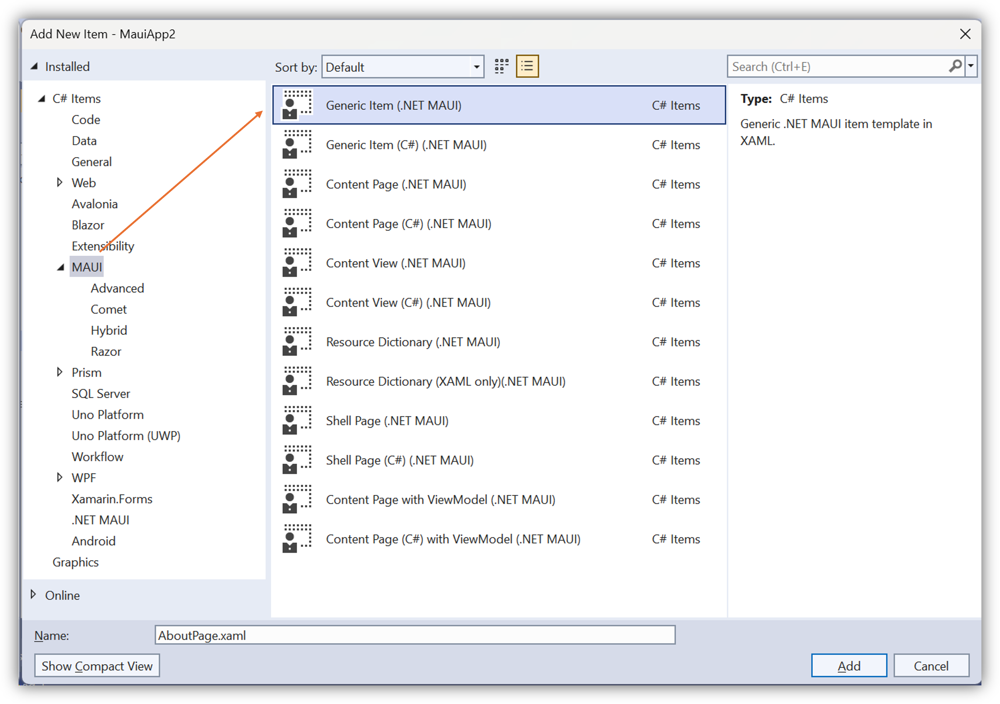

## .NET MAUI Project and Item Templates
This repository is to host the .NET MAUI Project and Item templates

We all know that .NET MAUI is an evolution of Xamarin.Forms.

And .NET 6 Preview 4 just got released last week in the **MSBuild 2021**. And Preview 5 is now available too.

With this new release, ContentPage is completely moved into .NET MAUI world with a brand new xml namespace and using directive.

So that the existing Xamarin.Forms item templates cannot be used as is from now on and modifying it every time is painful.

Hence have created new item templates exclusively to be used with .NET MAUI projects (both for XAML and C#).

Grab these templates from the [Releases](https://github.com/egvijayanand/dotnet-maui-templates/releases).

* MauiPageCS.zip
* MauiPageXaml.zip

To make it work, copy the 2 zip files to any of the below mentioned directory in your local machine (Create the folder structure, if not already present).

For current user - %UserProfile% is the users' directory, run echo command to know the exact location

```console
echo %UserProfile%
```
```console
mkdir "%UserProfile%\Documents\Visual Studio 2019\Templates\ItemTemplates\Visual C#\MAUI"
```

For all users:

Copy to this folder, if you want this to be available for all users accessing that machine (requires Administrator privilege) 

_(Note: Visual Studio edition needs to be updated properly, have mentioned below as **Preview**):_

```console
echo %ProgramFiles(x86)%
```

```console
mkdir "%ProgramFiles(x86)%\Microsoft Visual Studio\2019\Preview\Common7\IDE\ItemTemplates\CSharp\MAUI"
```

***After copying those Zip files, it is mandatory to restart the Visual Studio instance for custom templates like these to take effect.***

Screenshot shown for reference - Templates categorized as MAUI for quick access:



### .NET CLI Template

For making use of these templates cross-platform, have provided it as .NET CLI item template.

[](https://www.nuget.org/packages/VijayAnand.MauiPage/)

Install the item template from NuGet with the below command.

```console
dotnet new --install VijayAnand.MauiPage
```

The item template is named as **maui-page** and it takes two parameters:

Name: (Short form: -n)

The name of the file to create, _don't need to suffix it with xaml_, it will get added.

_If the name parameter is not specified, by default, the **.NET CLI template engine will take the current folder name as the filename** (current behaviour of the templating engine)._

Namespace: (Short form: -na)

The namespace for the generated files.

After installation, run the below command to make use of the template (both provide the same result):

```console
dotnet new maui-page -n MainPage -na TestApp.Views
```

```console
dotnet new maui-page --name MainPage --namespace TestApp.Views
```
